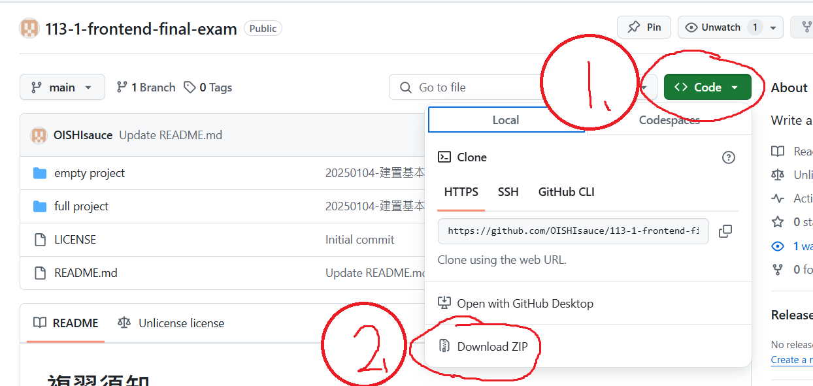
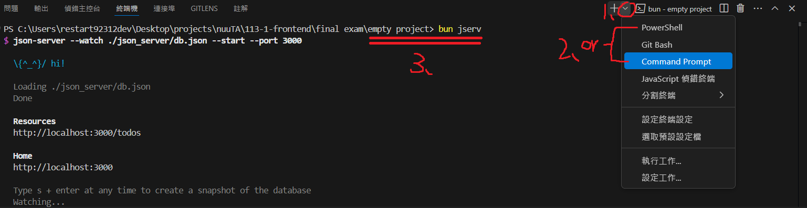

# 複習須知

-   本專案在 [GitHub](https://github.com/OISHIsauce/113-1-frontend-final-exam.git)上供同學自行下載使用。
-   `如何下載`：
-   這個 repository 包含兩個專案：`empty project`，及`full project`
-   `empty project`是考試時會給同學的專案，強烈建議用這個練習。
-   `full project`是助教寫的參考答案，如果練習時卡住可以隨時拿來參考。
-   正式考試環境包含：斷網、無 vscode 的擴充套件可用。若可能請以此基礎來練習。
-   有關 json_server（考試加分）的操作，請參閱下一段落。
-   （如果同學被當）下次修前端不會遇到這麼優秀又負責任的助教 _(微笑)_，請好好把握機會。
-   有緊急問題請馬上在 Line 上與助教反映，助教會盡可能的處理。 special thanks: 感謝同學反應 node_module 的問題。
-   承上，其他問題，請盡量在 [GitHub 的 Issues](https://github.com/OISHIsauce/113-1-frontend-final-exam/issues) 提出。

# json_server

> 請注意：錄製影片會用到 `rest client` 的 vscode 擴充套件來輔助開發，但考慮到上機環境沒有網路可以裝套件，而且**本條目在老師錄製影片結束前就開始製作，所以 full project 不會使用該技術**。取而代之的是，助教把對應的功能獨立寫成 `todoAPI` 了，詳情請參閱內文。

-   對於`./json_server/db.json`，**建議不要更動這個資料夾和檔案名稱**，因為它與 `bun jserv` 息息相關
-   如何啟動：新增一個終端機，在專案根目錄執行 `bun jserv` 就可以在 PORT 3000 開啟 json server
    

    > 如果同學的 PORT 3000 不能用，請至`./package.json`手動修改 jserv 指令，把 3000 改成同學要用的埠號

-   開啟之後，同學可以對 `http://localhost:3000/todos` 發起 http request 了
-   `empty project` 內容已經被更改，考試時同學可以實作 `todoAPI`，並用它完善同學的專案，（或是直接忽略它，在 `Todo.jsx` 裡直接寫也可以，助教沒意見）。

> 助教不能假設所有同學都要寫 Bonus，所以專案架構與老師稍顯不同，是以「噢，我寫完原本的題目了，我要開始寫 BONUS」的角度去設計的。

-   http request 操作需要一點知識和經驗，以下相對路徑都是以 `full project`為例。
-   `./src/data/todoAPI` 是進行 http request 的關鍵檔案，**剩餘內容請直接從中參考**。
-   建議在 `Todo.jsx` 看看 `todoAPI` 怎麼呼叫，尤其是 useEffect 中如何使用非同步函式是往年很多同學不熟的點。
-   雖然助教有進行單元測試，但如果同學開啟 `full project` 的網頁發現這些操作結果（新增、刪除、修改）並沒有被保留，請在 LINE 班群直接回報。

> 從重要事項開始的內容會在正式考試重複出現

# 重要事項

-   設備有問題、下載上傳檔案有問題，請馬上提出。
-   **助教在考試中不會給同學任何作答建議**，諸如程式撰寫、終端機操作等等，請提前做好準備。

---

# 考試說明

-   考試時間為 13:00 至 17:00
-   按下「待辦事項」按鈕後顯示的畫面是原始分數的評分標準（預設為`./src/pages/Todo.jsx`）。
-   App.jsx, Home.jsx 皆為可參考的範例。
-   同學可以分別從本專案的 `./src/examples/`裡的`01.png`、`02.png`、`03.png` 看到三大題型的題目圖例。
-   **麻煩上傳檔案的時候遵循以下步驟：**
    1. 將檔案加入名稱包含學號的壓縮檔 e.g.：`U1024035.zip`
    2. 將壓縮檔內的 `node_modules` 移除
    3. 上傳到 file zilla 的 upload 資料夾

---

# 分數標準

-   本考試宗旨是成果至上，助教基本只會看網頁評分，不會看你的程式碼（css 有疑惑會去看除外）。
-   若出現以下情況導致白畫面，分數以 0 分計：
    1. 因 JSX `編譯錯誤` 導致的白畫面。
    2. 因 JSX `執行錯誤` 導致白畫面為預設畫面（按按鈕導致的白畫面不會 0 分，但仍請避免）。
-   原始分數總和(含 Bonus)不會超過 100 分。
-   **周老師享有修改分數的權利**（原始分數不一定代表期末成績，分數可能向上調整）。

## 1. HTML (40%)

計分標準：是否能透過下列方法之一看到畫面內容：

1. 靜態顯示（不用進行操作就能看到）。
2. 互動顯示（能透過網頁互動看到）。

> 亦即，若不會寫互動的話：依靠互動顯示的題目（5. 6. 7.）可以改用靜態畫面得分。

每個畫面內容各佔 6%，但總分不超過 40%。畫面內容包含：

1.  「Todo List」標題。
2.  Text input。
3.  Date input。
4.  Add button。
5.  List item1（text, dueDate, 完成, 刪除, 編輯）。
6.  List item2（text, dueDate, 恢復, 刪除, 編輯，且文字有刪除線）。
7.  List item3（text input, date input, 更新, 取消）。

---

## 2. JavaScript (40%)

計分標準：是否能透過元件互動來達成功能：

每個功能各佔 6%，但總分不超過 40%。功能包含：

1. 透過 Add 按鈕新增並顯示一個 list item。
2. 透過完成按鈕，切換文字裝飾為刪除線，並將完成按鈕切換為恢復按鈕。
3. 完成 2.，透過恢復按鈕，將 list item 切換為原樣。
4. 透過刪除按鈕，正確刪除指定的 list item。
5. 透過編輯按鈕，將該列 list item 的文字切換為 input，並將按鈕列改成更新和取消。
6. 完成 5.，透過更新按鈕將 list item 切換為原樣，並修改 todo 和日期。
7. 完成 5.，透過取消按鈕將 list item 切換為原樣，且不做修改。

---

## 3. CSS (20%)

計分標準：是否正確使用 CSS 使外觀有明顯變化：

每題各佔 5%，但總分不超過 20%，單題不會部分給分。內容包含：

1. 使頁面整體水平置中，文字與日期間隔分明（Hint: `display`, `justify-content`）。
2. 至少各出現一次設定文字顏色、背景顏色，且明顯不是預設顏色。
3. 至少各出現一次設定外框顯示與弧度。
4. 設定外間距使 list item 的按鈕等距排列，設定內間距使 input、button 不要貼合文字。
5. 奇數與偶數的 list item 背景顏色不同（Hint: `nth-child`，其他實現方法不給分）。

**注意事項：**

-   請清楚顯示元件（如：背景顏色和文字顏色不得過於相近）。
-   顏色風格不拘，但不要與預設顏色一致。
-   間距、邊框弧度、邊框粗細的數字不拘，（但不要讓人看不出來有變）。

---

## 4. Bonus: JSON Server (20%)

每種操作佔 5% ，**正確依據為重整網頁是否保留原始操作**：

1. 查詢：能查詢已預先儲存的 todos
    - 如果你不會新增 todo，你可以手動打資料到 db.json 然後顯示即可。

> 請先確保查詢正確，再做以下功能，否則不予計分。

2. 新增：正確新增一筆 todo
3. 修改：正確修改一筆 todo
4. 刪除：正確刪除一筆 todo
